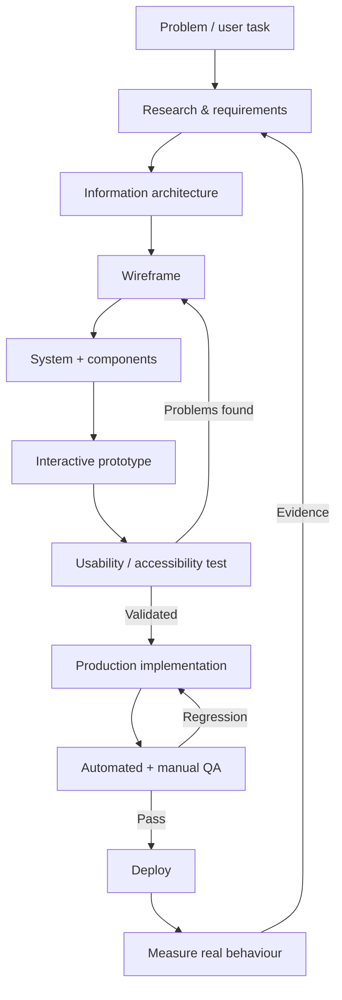
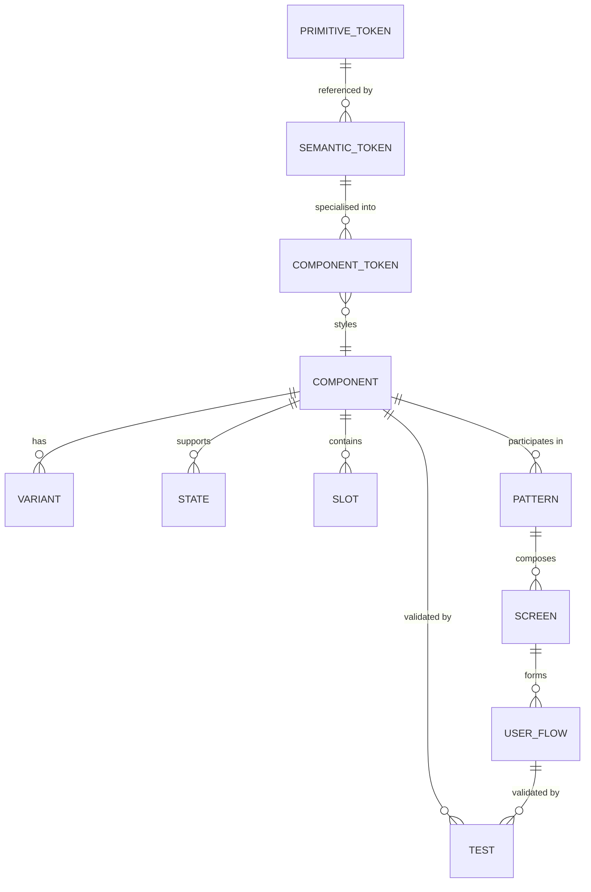
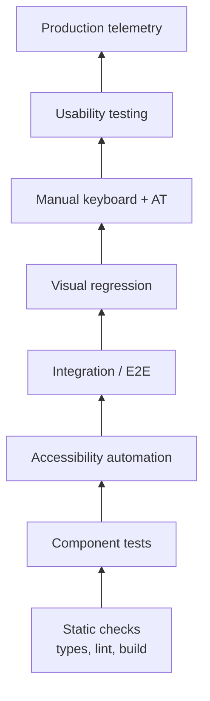

# Comprehensive Course Blueprint for Great Website and Application Design

## Executive summary

A course that reliably produces **great, working digital products** cannot stop at visual design. It must teach learners to move through the entire product-delivery loop: understand a problem, structure information, design responsive interfaces, implement reusable components, meet accessibility requirements, prototype behaviour, measure performance, test systematically, deploy safely, and maintain what they ship. This conclusion is consistent with the way the major platform systems divide their guidance: Apple’s Human Interface Guidelines address platform interaction and interface conventions; Material and Fluent connect foundations to reusable components and platform implementations; Figma connects reusable design structures to development hand-off; WCAG defines testable accessibility criteria; and modern performance, testing and deployment documentation treats quality as an ongoing engineering process rather than a final polish step. citeturn12view0turn12view2turn15view3turn12view7turn13view3turn14view4

The research began with the enabled **Figma connector**, as requested. The connector is authenticated and operational, but no specific Figma file, file key or node was supplied, so it would have been improper to pretend to analyse a particular design file. The curriculum therefore uses Figma as its primary collaborative design environment while grounding Figma-specific teaching in its official documentation. Figma Auto Layout now covers vertical, horizontal and grid flows; responsive resizing includes Hug contents, Fill container, fixed and minimum/maximum dimensions; variables can hold state for higher-fidelity prototypes; and Dev Mode provides a developer-focused interface around inspectable designs and work marked ready for development. citeturn12view2turn12view3turn12view4

The recommended programme is a **154-hour core curriculum**, roughly equivalent to 24 weeks at about 6–7 focused hours per week, or an intensive 10–12-week programme. It progresses from interface foundations into system design, implementation and production delivery:

```mermaid
flowchart LR
    A["Beginner<br/>Website Design"] --> B["App Design"]
    B --> C["Typography"]
    C --> D["Accessibility"]
    D --> E["Design Systems<br/>& Components"]
    E --> F["Interaction<br/>& Motion"]
    F --> G["Prototyping<br/>& Handoff"]
    G --> H["Performance<br/>& Optimisation"]
    H --> I["Testing & QA"]
    I --> J["Deployment<br/>& Maintenance"]
    J --> K["Integrated Projects<br/>& Capstone"]
```



The recommended 154 hours are distributed as follows.

| Course section | Core time | Principal outcome |
|---|---:|---|
| Website Design | 14 h | Responsive, semantic, implementation-ready web interfaces |
| App Design | 14 h | Platform-aware native/mobile application interfaces |
| Typography | 8 h | Responsive and accessible typographic systems |
| Accessibility | 14 h | WCAG-aware and assistive-technology-tested interfaces |
| Design Systems & Components | 16 h | Tokenised, reusable cross-design/code systems |
| Interaction & Motion | 10 h | Intentional, accessible interactive behaviour |
| Prototyping & Handoff | 10 h | Testable prototypes and developer-ready specifications |
| Performance & Optimisation | 12 h | Measurable web/native performance |
| Testing & QA | 14 h | Repeatable functional, visual and accessibility validation |
| Deployment & Maintenance | 10 h | CI/CD, release governance and product maintenance |
| Practical Projects/Exercises | 32 h | Portfolio-quality integrated products |
| **Total** | **154 h** | **Design-to-production capability** |

The key educational principle is that learners should not be rewarded merely for producing attractive screens. A finished product must pass several independent gates: **usefulness, usability, visual quality, accessibility, technical correctness, performance, robustness and maintainability**. For web work, the course should use WCAG 2.2 AA as the accessibility baseline and the current Core Web Vitals as performance targets. Google currently defines “good” Core Web Vitals as LCP ≤2.5 s, INP ≤200 ms and CLS ≤0.1 at the 75th percentile, segmented by mobile and desktop. citeturn12view7turn13view3

The programme should also deliberately teach **platform adaptation rather than pixel-identical cross-platform design**. Apple, Material and Fluent all expose related ideas—hierarchy, reusable components, typography, spacing, motion and accessibility—but each expresses them according to its own platform conventions. Apple continues actively updating its design resources: on 23 June 2026 it published updated iOS/iPadOS 27 and macOS 27 Figma kits, following its June 2026 design-resource releases. citeturn12view1

The final standard for graduation should therefore be: **a learner can take a product from problem definition to a deployed, tested and maintainable implementation without losing the design intent—or the user—between Figma and code.**

## Evidence base, assumptions and course architecture

**Research priorities.** The investigation concentrated on six questions: what makes responsive interfaces structurally sound; what differs between web and native application interaction models; how typography and accessibility should constrain design; how reusable design systems bridge Figma and production code; how interaction quality and performance are measured; and what testing/deployment practices turn prototypes into maintainable software. Primary documentation was preferred wherever available, including Apple Developer, Figma, Google/Android/Material, Microsoft Fluent, W3C, Chrome/web.dev, Playwright, GitHub and OWASP. Foundational HCI literature was used selectively rather than treating popular “UX laws” as absolute rules.

**Assumptions.** No single operating system, web framework or application framework is mandated. Figma is the recommended design environment because it directly supports the requested design workflow and because official Apple and Fluent UI kits are supplied through Figma. Apple’s current design resources explicitly provide platform templates, and Fluent’s Figma kits include code-aligned building blocks for web, iOS and Android. citeturn12view1turn15view3

The recommended implementation paths are:

| Learner goal | Minimum implementation path |
|---|---|
| Designer who needs production literacy | HTML + CSS + basic JavaScript + Git |
| Web product designer/developer | HTML/CSS/TypeScript + chosen framework + Playwright |
| Apple specialist | Swift + SwiftUI + Xcode |
| Android specialist | Kotlin + Jetpack Compose + Android Studio |
| Cross-platform product designer | Web foundations plus at least one native implementation path |
| Advanced design-system specialist | Figma Variables/Components + tokens + component library + CI/testing |

A learner who has never coded should complete a **20–30-hour optional coding primer** before the implementation-heavy second half. That primer should cover semantic HTML, CSS layout, variables/functions/events in JavaScript, Git fundamentals, terminal basics and reading component code. The 20–30 hours are an instructional recommendation, not part of the 154-hour core.

Figma should be taught as a **model of interface behaviour rather than a drawing programme**. Auto Layout reacts when children or dimensions change and supports responsive resizing; variables can represent stored state in prototypes; Dev Mode gives developers an inspection-oriented view and exposes designs explicitly marked ready for development. Those concepts closely parallel production concerns such as layout constraints, state, tokens and implementation status. citeturn12view2turn12view3turn12view4

The recommended pedagogical loop is:



This continuous loop matters because neither automated tools nor prototypes can establish product quality alone. Playwright explicitly notes that automated accessibility testing catches only some problems and recommends combining automation with manual accessibility assessment and inclusive user testing. Likewise, Google distinguishes laboratory performance measurements used during development from field measurements reflecting real users. citeturn13view7turn13view3

For interaction design, foundational HCI concepts should be taught as reasoning aids rather than dogma. Fitts’s foundational work concerns the information capacity of human motor movement and is the intellectual basis for the familiar relationship between target size/distance and pointing difficulty; it is useful when discussing button size, reach and pointer efficiency, but modern platform target-size rules should be used for actual acceptance criteria. citeturn14view5

## Detailed syllabus and module specifications

**Website Design — 14 hours**

**Learning objectives.** Learners should be able to transform content and user tasks into semantic information architecture; create responsive layouts rather than fixed-width mock-ups; use grids, spacing and visual hierarchy deliberately; design navigation and forms; and implement the resulting interface with semantic HTML and adaptable CSS. Figma Auto Layout is particularly appropriate for teaching responsive relationships because its parent/child resizing model, wrapping and grid capabilities respond to content and container changes rather than relying entirely on fixed coordinates. citeturn12view3

| Lesson | Time | Syllabus |
|---|---:|---|
| Web structure and information architecture | 2 h | User tasks, page hierarchy, landmarks, content priority, semantic page anatomy |
| Responsive layout | 3 h | Intrinsic sizing, grid/flex concepts, Figma Auto Layout, content-driven breakpoints |
| Navigation and content patterns | 3 h | Header, navigation, cards, lists, search, filtering, empty/loading/error states |
| Forms and transactional interfaces | 3 h | Labels, input states, validation, progressive disclosure and confirmation |
| Design-to-browser build | 3 h | Translate Figma structure into HTML/CSS; responsive QA; browser inspection |

**Prerequisites/tools:** Figma; a modern browser; browser DevTools; code editor; basic HTML/CSS; Git recommended.

**Recommended primary readings:** [Figma Auto Layout](https://help.figma.com/hc/en-us/articles/360040451373-Guide-to-auto-layout), [Apple HIG](https://developer.apple.com/design/human-interface-guidelines/), [Fluent Layout](https://fluent2.microsoft.design/layout), [WCAG 2.2 Quick Reference](https://www.w3.org/WAI/WCAG22/quickref/). Fluent’s current layout guidance uses spacing to express relationships and hierarchy, with a multi-platform spacing ramp based principally on 4-unit increments rather than arbitrary one-off values. citeturn15view1

**Practical exercise and deliverable:** redesign a content-heavy service website at narrow phone, tablet/intermediate and wide desktop sizes. Deliver a Figma source file using Auto Layout, content inventory, sitemap, wireframes, responsive high-fidelity screens and a working semantic HTML/CSS implementation.

**Representative web implementation:**

```html
<main class="page">
  <section class="hero" aria-labelledby="hero-title">
    <div>
      <p class="eyebrow">Personal finance</p>
      <h1 id="hero-title">Make your money easier to understand.</h1>
      <p>One clear place for goals, spending and progress.</p>
      <a class="button" href="/start">Get started</a>
    </div>
  </section>
</main>
```

```css
.page {
  width: min(100% - 2rem, 72rem);
  margin-inline: auto;
}

.hero {
  display: grid;
  gap: clamp(1rem, 3vw, 3rem);
  padding-block: clamp(3rem, 8vw, 8rem);
}

h1 {
  font-size: clamp(2.25rem, 6vw, 5rem);
  line-height: 1.05;
  max-inline-size: 14ch;
}

.button {
  display: inline-flex;
  min-block-size: 2.75rem;
  align-items: center;
  padding-inline: 1rem;
}
```

**Accessibility checklist:** semantic landmarks; logical heading hierarchy; visible keyboard focus; operable navigation without pointer input; labelled form controls; text alternatives; no information conveyed by colour alone; sufficient contrast; zoom/reflow testing; understandable errors. WCAG 2.2 explicitly covers keyboard operation, focus visibility, headings and labels, target size, error identification and reflow. citeturn12view7

**Performance checklist:** explicit image dimensions; responsive image sources; avoid shipping imagery larger than rendered need; minimise layout shifts; reserve space for asynchronous content; prioritise the principal visible content; limit unnecessary JavaScript; test representative low-end/mobile conditions. Core Web Vitals explicitly measure loading, interaction responsiveness and visual stability. citeturn13view3

**Assessment:** hierarchy/IA 20%; responsive behaviour 25%; semantic/accessibility quality 20%; implementation correspondence 20%; visual polish 15%.

**Capstone milestone:** a production-ready responsive marketing/onboarding area with documented breakpoint behaviour and component states.

**App Design — 14 hours**

**Learning objectives.** Learners should understand application navigation, transient/persistent state, platform conventions, safe areas/insets, feedback, permissions and lifecycle states; recognise when iOS, Android and web behaviours should diverge; and build one real native interface rather than only imitating native screens in Figma. Apple maintains platform-specific HIG guidance and design resources, while Android’s Material 3 implementation provides platform components and adaptive typography/theme behaviour. citeturn12view0turn12view1turn15view6

| Lesson | Time | Syllabus |
|---|---:|---|
| App mental models and navigation | 2 h | Hierarchy, tabs, stack navigation, modal tasks, back behaviour |
| Platform conventions | 3 h | Apple HIG vs Material/Android vs Fluent; system controls and platform adaptation |
| State-rich interface design | 3 h | Loading, offline, empty, partial, optimistic, error and success states |
| Adaptive mobile layouts | 3 h | Orientation, safe regions, insets, large screens and dynamic content |
| Native implementation lab | 3 h | Implement one core flow in SwiftUI or Jetpack Compose |

**Prerequisites/tools:** Figma; mobile interaction fundamentals; Swift/Xcode for Apple path or Kotlin/Android Studio for Android path.

**Readings:** [Apple Human Interface Guidelines](https://developer.apple.com/design/human-interface-guidelines/), [Apple Design Resources](https://developer.apple.com/design/resources/), [Material Design 3](https://m3.material.io/), [Material 3 in Jetpack Compose](https://developer.android.com/develop/ui/compose/designsystems/material3), [Fluent 2](https://fluent2.microsoft.design/). Apple’s 2026 resources include updated iOS/iPadOS and macOS Figma kits, making contemporary platform kits useful teaching material rather than asking students to recreate native controls from memory. citeturn12view1

**Exercise:** create a three-to-five-screen transactional app flow—such as goal creation, transfer setup or appointment booking—with normal, loading, validation, empty and failure states. Implement the main screen natively.

**SwiftUI example:**

```swift
import SwiftUI

struct GoalView: View {
    @State private var saved = false

    var body: some View {
        NavigationStack {
            Form {
                Section("Goal") {
                    TextField("Name", text: .constant(""))
                    TextField("Target amount", text: .constant(""))
                        .keyboardType(.decimalPad)
                }

                Button("Save goal") {
                    saved = true
                }
            }
            .navigationTitle("New goal")
            .alert("Goal saved", isPresented: $saved) {
                Button("Done", role: .cancel) { }
            }
        }
    }
}
```

**Jetpack Compose equivalent:**

```kotlin
@Composable
fun GoalScreen(onSave: () -> Unit) {
    Scaffold(
        topBar = {
            TopAppBar(title = { Text("New goal") })
        }
    ) { padding ->
        Column(
            modifier = Modifier
                .padding(padding)
                .padding(16.dp),
            verticalArrangement = Arrangement.spacedBy(16.dp)
        ) {
            OutlinedTextField(
                value = "",
                onValueChange = {},
                label = { Text("Goal name") }
            )
            Button(onClick = onSave) {
                Text("Save goal")
            }
        }
    }
}
```

Material’s own Compose guidance recommends using its semantic colour roles rather than arbitrarily pairing colours because built-in Material components and themes are structured to support accessible contrast. citeturn15view6

**Accessibility checklist:** Dynamic Type/scalable text; VoiceOver/TalkBack reading order; meaningful control names; touch targets; orientation/adaptation; system accessibility settings; non-colour state indicators; error announcements.

**Performance checklist:** avoid loading everything before first meaningful interaction; virtualise long collections; cache/reuse expensive calculations where appropriate; test release rather than debug builds. Android’s current Compose performance guidance explicitly recommends release/R8 testing, Baseline Profiles, stable keys for lazy layouts and avoiding unnecessary recompositions. citeturn13view6

**Assessment:** navigation/model 20%; state coverage 20%; platform appropriateness 20%; accessibility 15%; native implementation 15%; visual craft 10%.

**Capstone milestone:** one complete native journey corresponding to an equivalent web journey but adapted to the chosen platform.

**Typography — 8 hours**

**Learning objectives.** Learners should create a semantic type hierarchy, choose appropriate typefaces, control measure, leading, scale and emphasis, design responsive type rather than fixed screenshots, and support platform text scaling. Apple’s typography guidance should be paired with Dynamic Type concepts; Fluent explicitly organises its typography as semantic ramps and uses native platform font stacks, while Material 3 has a device-aware type scale. citeturn13view0turn15view7turn15view6

| Lesson | Time | Syllabus |
|---|---:|---|
| Typography as information architecture | 2 h | Hierarchy, semantic roles, type families, weights and contrast |
| Reading and rhythm | 2 h | Measure, line-height, spacing, alignment and density |
| Responsive typography | 2 h | `rem`, relative units, `clamp()`, zoom and localisation |
| Native scaling and QA | 2 h | Dynamic Type, Android scalable units, truncation and extreme-content tests |

**Tools:** Figma text styles/variables; browser; SwiftUI/Compose for native track.

**Readings:** [Apple HIG Typography](https://developer.apple.com/design/human-interface-guidelines/typography), [Fluent Typography](https://fluent2.microsoft.design/typography), [Material Design 3](https://m3.material.io/). Fluent currently recommends native system fonts across platforms and provides separate semantic type ramps for web, Windows, macOS, iOS and Android. citeturn15view7

**Exercise:** create one content page with at least six semantic text roles, then stress-test it at long translations, browser zoom and native text scaling.

```css
:root {
  --text-body: clamp(1rem, 0.96rem + 0.2vw, 1.125rem);
  --text-title: clamp(2rem, 1.35rem + 3vw, 4.5rem);
}

body {
  font-size: var(--text-body);
  line-height: 1.55;
}

h1 {
  font-size: var(--text-title);
  line-height: 1.05;
  text-wrap: balance;
}
```

```swift
Text("Your monthly overview")
    .font(.title)
    .fontWeight(.semibold)

Text("Spending is down from last month.")
    .font(.body)
```

The native example intentionally selects semantic SwiftUI font roles rather than locking all text to arbitrary point values, allowing the platform text system to participate in sizing behaviour.

**Accessibility checklist:** minimum contrast; zoom/scaling without clipping; readable hierarchy independent of colour; adequate line spacing; avoid images of important text; no essential copy hidden by truncation. Fluent cites WCAG-equivalent contrast thresholds of at least 4.5:1 for standard text and 3:1 for qualifying large text. citeturn15view7

**Performance checklist:** keep webfont families/weights deliberate; use effective fallback fonts; avoid typography-driven layout shift; do not download decorative fonts that contribute little product value.

**Assessment:** hierarchy 30%; readability 25%; responsive/scalable behaviour 20%; accessibility 15%; implementation accuracy 10%.

**Capstone milestone:** shared type roles with mappings for Figma, CSS and the selected native platform.

**Accessibility — 14 hours**

**Learning objectives.** Learners should be capable of designing and testing against WCAG 2.2 rather than treating accessibility as a colour-contrast check. WCAG 2.2 addresses perceivable content, keyboard access, focus, reflow, target sizing, labels, errors and other interaction concerns; Compose exposes accessibility semantics and testing support; Apple provides accessibility-specific design and development guidance. citeturn12view7turn13view1turn13view5

| Lesson | Time | Syllabus |
|---|---:|---|
| Disability, inclusive design and WCAG | 2 h | Permanent, temporary and situational barriers; POUR model; A/AA/AAA |
| Semantic structure and assistive technology | 3 h | HTML semantics, accessible names, landmarks, headings, native semantics |
| Keyboard, focus and input | 3 h | Focus order, focus visibility, dialogs, menus, pointer alternatives, targets |
| Forms, errors, colour and media | 3 h | Labels, help, error recovery, contrast, captions, non-colour cues |
| Accessibility testing laboratory | 3 h | Keyboard-only, screen readers, automated scanning, accessibility inspectors |

**Tools:** browser accessibility tree; keyboard; VoiceOver and/or TalkBack; Apple Accessibility Inspector for Apple work; Playwright + axe for web automation. Android Compose provides semantics, traversal control, scalable-content support, inspection/debugging and accessibility testing facilities. citeturn13view5

**Readings:** [WCAG 2.2 Quick Reference](https://www.w3.org/WAI/WCAG22/quickref/), [WAI-ARIA Authoring Practices](https://www.w3.org/WAI/ARIA/apg/), [Apple HIG Accessibility](https://developer.apple.com/design/human-interface-guidelines/accessibility), [Android Compose Accessibility](https://developer.android.com/develop/ui/compose/accessibility), [Playwright Accessibility Testing](https://playwright.dev/docs/accessibility-testing).

**Exercise:** conduct an accessibility audit on an intentionally flawed checkout/application form, repair the implementation, and submit before/after results plus a manual screen-reader walkthrough.

**Web example:**

```html
<form>
  <div>
    <label for="amount">Transfer amount</label>
    <input
      id="amount"
      name="amount"
      inputmode="decimal"
      aria-describedby="amount-help amount-error"
    />
    <p id="amount-help">Maximum transfer: £5,000.</p>
    <p id="amount-error" role="alert" hidden>
      Enter an amount between £1 and £5,000.
    </p>
  </div>

  <button type="submit">Review transfer</button>
</form>
```

Native UI should likewise preserve meaning rather than merely presenting pixels. Compose exposes semantics specifically to represent meanings, roles, descriptions and state to accessibility services. citeturn13view5

**Accessibility checklist:** WCAG 2.2 AA matrix; semantic-native elements first; names/roles/states; keyboard; visible focus; no keyboard trap; 200%+ zoom/reflow testing; contrast; touch/pointer target spacing; form errors in text; screen-reader core-flow test; reduced-motion behaviour; captions/transcripts where relevant. WCAG’s Quick Reference includes these categories explicitly. citeturn12view7

**Performance checklist:** accessibility must not depend on a large client-side library before basic controls work; preserve meaningful DOM structure; avoid massive redundant accessibility trees; do not use animation or effects that materially delay task completion.

**Assessment:** WCAG reasoning 25%; semantic implementation 25%; keyboard/focus 15%; assistive-technology testing 20%; issue documentation/remediation 15%.

A crucial teaching rule is that an automated “zero violations” result is **not an accessibility certificate**. Playwright itself states that many accessibility defects require manual testing and recommends automation plus manual assessment plus inclusive user testing. citeturn13view7

**Capstone milestone:** documented accessibility acceptance criteria for every critical journey and a manual AT test record.

**Design Systems & Components — 16 hours**

**Learning objectives.** Learners should move from individual screens to reusable foundations: primitive/global tokens, semantic/alias tokens, component APIs, variants, states, slots, themes, documentation and governance. Fluent provides a particularly explicit model: global tokens hold raw/context-agnostic values while alias tokens assign semantic meaning, and its current Figma UI kits map component properties towards code. citeturn15view0turn15view3

| Lesson | Time | Syllabus |
|---|---:|---|
| From screens to systems | 3 h | Foundations, tokens, primitives, components, patterns |
| Token architecture | 3 h | Primitive/global vs semantic/alias vs component tokens; modes/themes |
| Component modelling | 3 h | Anatomy, properties, variants, states, slots and content rules |
| Figma-to-code system | 4 h | Variables, component properties, Auto Layout, implementation contracts |
| Governance and evolution | 3 h | Versioning, contribution rules, deprecation, documentation, adoption |

**Prerequisites/tools:** solid Figma skills; basic CSS or native component knowledge; Git recommended. Figma variables and Fluent’s Figma system make light/dark and other contextual modes a natural teaching mechanism. citeturn12view4turn15view3

**Readings:** [Figma Variables](https://help.figma.com/hc/en-us/articles/15339657135383-Guide-to-variables-in-Figma), [Fluent Design Tokens](https://fluent2.microsoft.design/design-tokens), [Material Design 3](https://m3.material.io/), [Apple HIG](https://developer.apple.com/design/human-interface-guidelines/).

**Exercise:** create a mini system containing colour, spacing, radius and typography tokens plus Button, Text Field, Card, Alert and Dialog components. Each must specify default, hover/pressed where applicable, focus, disabled and error/validation behaviour.

**Token/component example:**

```css
:root {
  /* Primitive layer */
  --blue-600: #2457d6;
  --space-2: 0.5rem;
  --space-3: 0.75rem;

  /* Semantic layer */
  --colour-action-primary: var(--blue-600);
  --space-control-inline: var(--space-3);
}

.button {
  background: var(--colour-action-primary);
  padding: var(--space-2) var(--space-control-inline);
  border-radius: 0.5rem;
}
```

A design system should represent component state explicitly:

```text
Button
├── Appearance: primary | secondary | subtle | destructive
├── Size: small | medium | large
├── State: default | hover | pressed | focus | disabled | loading
├── Leading icon: optional
├── Trailing icon: optional
└── Label: required
```

**Accessibility checklist:** all components define keyboard behaviour, focus appearance, accessible name requirements, contrast expectations and disabled/loading semantics; custom components are not accepted merely because they visually match the library.

**Performance checklist:** avoid components that import large dependencies for trivial behaviour; tree-shake/split packages where appropriate; avoid excessive nested wrappers; prevent unnecessary rerendering; provide asset guidance.

**Assessment:** token architecture 20%; component API 25%; states/accessibility 20%; design-code correspondence 20%; documentation/governance 15%.

**Capstone milestone:** capstone UI must be composed primarily from a documented mini design system rather than unique one-off components.

**Interaction & Motion — 10 hours**

**Learning objectives.** Learners should understand affordance, state feedback, transition continuity, timing/easing, gesture consequences and reduced-motion alternatives. Motion should explain relationships or reinforce feedback rather than act as unrelated decoration. Fluent’s motion principles emphasise functional, natural, consistent and appealing movement, while WCAG includes requirements relating to flashing and motion triggered by interaction. citeturn12view7

| Lesson | Time | Syllabus |
|---|---:|---|
| Interaction feedback | 2 h | Hover, focus, pressed, loading, optimistic and completion feedback |
| Motion foundations | 2 h | Duration, easing, continuity, entering/leaving and state change |
| Gestures and advanced transitions | 3 h | Drag, swipe, sheets, shared context, interruption and cancellation |
| Accessible motion laboratory | 3 h | Reduced motion, vestibular safety, performance profiling |

**Readings:** [Apple HIG](https://developer.apple.com/design/human-interface-guidelines/), [Fluent 2](https://fluent2.microsoft.design/), [WCAG 2.2 Quick Reference](https://www.w3.org/WAI/WCAG22/quickref/), and Fitts’s seminal movement paper via [PubMed](https://pubmed.ncbi.nlm.nih.gov/1402698/). Fitts’s original 1954 work was later republished as a seminal article; it remains useful background when explaining why hard-to-reach tiny controls increase motor demands. citeturn14view5

**Exercise:** prototype and implement a disclosure panel, modal transition and sortable or draggable interaction, each with a reduced-motion alternative.

```css
.card {
  transition:
    transform 180ms ease,
    opacity 180ms ease;
}

.card[data-entering="true"] {
  opacity: 0;
  transform: translateY(0.5rem);
}

@media (prefers-reduced-motion: reduce) {
  .card {
    transition: none;
    transform: none;
  }
}
```

WCAG 2.2’s reference material includes animation-from-interactions guidance and limits potentially harmful flashing, so reduced-motion considerations belong in interaction specifications rather than being postponed until QA. citeturn12view7

**Accessibility checklist:** essential state is understandable without animation; keyboard equivalents for gesture-only actions; motion preference respected; no harmful flashing; focus follows overlays/dialogs correctly; drag actions have alternatives when required.

**Performance checklist:** animate properties that avoid unnecessary layout work where practical; avoid long blocking work before feedback; inspect frame stability on low-end hardware; interruptible interactions should remain responsive.

**Assessment:** behavioural clarity 30%; motion craft 20%; accessibility 25%; implementation responsiveness 15%; documentation 10%.

**Capstone milestone:** a motion specification defining purpose, trigger, entering/exiting states and reduced-motion behaviour for every significant transition.

**Prototyping & Handoff — 10 hours**

**Learning objectives.** Learners should distinguish prototypes used to answer questions from decorative “demo reels”; prototype real task flows and edge states; document behaviour and acceptance criteria; and provide implementation information without making developers reverse-engineer a picture. Figma variables can store and mutate state and support conditional prototype logic, while Dev Mode provides developer-centric navigation and surfaces assets marked ready for development. citeturn12view4turn12view2

| Lesson | Time | Syllabus |
|---|---:|---|
| Prototype fidelity strategy | 2 h | Paper/low-fidelity, structural, high-fidelity and coded prototypes |
| Stateful prototypes | 3 h | Variables, component variants, conditional flows and realistic content |
| Usability sessions | 2 h | Task scripts, observation, severity and iteration |
| Development handoff | 3 h | Ready-for-dev criteria, specs, edge cases, tokens, assets and acceptance criteria |

**Tools:** Figma prototypes/variables; Dev Mode; issue tracker; optionally Storybook or equivalent component documentation.

**Readings:** [Figma Variables](https://help.figma.com/hc/en-us/articles/15339657135383-Guide-to-variables-in-Figma), [Figma Dev Mode](https://help.figma.com/hc/en-us/articles/15023124644247-Guide-to-Dev-Mode), [Figma Auto Layout](https://help.figma.com/hc/en-us/articles/360040451373-Guide-to-auto-layout). Figma states that variables can change content, visibility and appearance from interactions without requiring a separate frame for every state. citeturn12view4

**Exercise:** prototype one critical journey containing at least one validation error, cancellation path, loading state and successful completion. Conduct three structured usability sessions, revise the prototype, then submit the developer hand-off.

**Component contract example:**

```text
TransferAmountField

Inputs
  value: Decimal
  currency: CurrencyCode
  availableBalance: Decimal
  error: String?

Behaviour
  Empty -> neutral
  Invalid -> error text + accessible announcement
  Valid -> Continue enabled
  Submitting -> controls locked + progress state

Acceptance criteria
  Keyboard-only operable
  Screen-reader label includes currency
  Error persists until corrected
  Long currency/localised values do not clip
```

**Accessibility checklist:** prototype includes focus sequence, accessible copy, error states, reduced-motion alternatives and intended accessibility names—not merely visual screens.

**Performance checklist:** handoff identifies critical imagery/assets, lazy-vs-eager loading expectations, skeleton/loading strategies and any interaction where latency must be masked honestly rather than deceptively.

**Assessment:** realism 20%; flow completeness 25%; evidence from usability testing 20%; hand-off quality 25%; accessibility/performance specification 10%.

**Capstone milestone:** formal “ready for development” package including flows, edge states, component references and acceptance tests.

**Performance & Optimisation — 12 hours**

**Learning objectives.** Learners should understand that speed is a product-design constraint, not merely an engineering clean-up. They should measure rather than guess, distinguish field from laboratory measurements, identify loading/interactivity/layout-shift problems, design appropriate skeleton/loading states, and understand equivalent native-performance principles. Google’s current Core Web Vitals focus on LCP, INP and CLS; lab testing helps catch regressions pre-release, while field data captures real-user experience. citeturn13view3

| Lesson | Time | Syllabus |
|---|---:|---|
| Performance as UX | 2 h | Perceived vs measured latency; budgets and critical journeys |
| Web loading performance | 3 h | LCP, images, fonts, caching, rendering and network waterfalls |
| Responsiveness and stability | 3 h | INP, main-thread work, CLS, async content and SPA navigation |
| Native performance | 2 h | Lists, state/recomposition, startup and release profiling |
| Measurement and regression gates | 2 h | Field telemetry, Lighthouse, CI budgets and dashboards |

**Readings:** [Web Vitals](https://web.dev/articles/vitals), [Lighthouse](https://developer.chrome.com/docs/lighthouse/overview), [Jetpack Compose Performance](https://developer.android.com/develop/ui/compose/performance). Lighthouse provides automated audits across performance, accessibility, SEO and other quality categories and can be run via DevTools, CLI or Node; Lighthouse CI can be incorporated into regression prevention. citeturn14view1

**Exercise:** deliberately build a slow page, establish a baseline, optimise it, and present a performance investigation explaining *why* each change altered the metrics.

```html

```

For Android performance exercises:

```kotlin
LazyColumn {
    items(
        items = transactions,
        key = { it.id }
    ) { transaction ->
        TransactionRow(transaction)
    }
}
```

Android’s current Compose performance guidance recommends stable keys for lazy lists, `remember` for expensive calculations, `derivedStateOf` when appropriate, Baseline Profiles for critical journeys and release-mode measurement. citeturn13view6

**2026-specific curriculum note.** Chrome 151 introduced APIs allowing Core Web Vitals measurement across SPA “soft” route transitions. As of August 2026 those APIs were beginning to be adopted by `web-vitals`, RUM tools and Chrome DevTools, but CrUX integration had no published timeframe and other browser engines did not yet support the new APIs. The course should therefore teach this as an evolving measurement capability rather than claiming SPA route-level CWV data is universally comparable across browsers. citeturn13view4

**Accessibility checklist:** loading optimisation must not remove accessible names or semantic structure; skeletons should not create noisy AT output; focus must survive deferred rendering; keyboard input must remain responsive.

**Performance checklist:** LCP ≤2.5 s, INP ≤200 ms and CLS ≤0.1 at the 75th percentile where representative field data are available; lab tests before deployment; monitor mobile and desktop separately; RUM in production where practical. citeturn13view3

**Assessment:** diagnostic reasoning 30%; measurable improvement 30%; technical correctness 20%; preservation of accessibility/visual quality 10%; reporting 10%.

**Capstone milestone:** a documented performance budget and before/after measurement record for the final product.

**Testing & QA — 14 hours**

**Learning objectives.** Learners should be able to convert design requirements into testable acceptance criteria; create functional, accessibility and visual regression tests; maintain a device/browser matrix; perform exploratory testing; and distinguish automation from human judgement. Playwright supports automated accessibility scans and screenshot comparisons, but its own documentation stresses that automated accessibility coverage is incomplete. citeturn13view7turn14view0

| Lesson | Time | Syllabus |
|---|---:|---|
| QA strategy and acceptance criteria | 2 h | Requirements, risk, severity, P0/P1/P2 defects, happy/unhappy paths |
| Functional and end-to-end automation | 3 h | User-facing selectors, deterministic test data, core journeys |
| Accessibility QA | 3 h | Automated axe checks plus keyboard/screen-reader manual testing |
| Visual and responsive regression | 3 h | Screenshot baselines, cross-viewport states and rendering variance |
| Exploratory/device QA | 3 h | Browser/device matrix, localisation, offline/error, release candidate |

**Readings:** [Playwright Accessibility Testing](https://playwright.dev/docs/accessibility-testing), [Playwright Visual Comparisons](https://playwright.dev/docs/test-snapshots), [WCAG Quick Reference](https://www.w3.org/WAI/WCAG22/quickref/).

**Exercise:** create a QA suite for the previous project containing at least one end-to-end happy path, one validation/error path, an axe scan and visual regression snapshots.

```ts
import { test, expect } from '@playwright/test';
import AxeBuilder from '@axe-core/playwright';

test('transfer review is usable and accessible', async ({ page }) => {
  await page.goto('/transfer');

  await page.getByLabel('Transfer amount').fill('125');
  await page.getByRole('button', { name: 'Review transfer' }).click();

  await expect(
    page.getByRole('heading', { name: 'Review transfer' })
  ).toBeVisible();

  const results = await new AxeBuilder({ page }).analyze();
  expect(results.violations).toEqual([]);

  await expect(page).toHaveScreenshot('transfer-review.png');
});
```

Playwright supports `toHaveScreenshot()` against generated reference screenshots and warns that rendering differs by operating system, browser version, fonts, hardware and related environmental factors; baselines should therefore be produced in controlled environments. citeturn14view0

**Accessibility checklist:** automated scan; keyboard-only journey; focus order; screen reader; zoom/reflow; error handling; contrast; touch/pointer interaction; reduced-motion state.

**Performance checklist:** QA suite includes at least a smoke performance gate; test assets approximate production conditions; automation itself does not conceal severe runtime errors; performance regressions block promotion when agreed budgets fail.

**Assessment:** coverage/risk reasoning 20%; automated tests 25%; accessibility QA 20%; exploratory/manual QA 20%; defect reporting 15%.

**Capstone milestone:** CI-ready quality suite attached to the final product.

**Deployment & Maintenance — 10 hours**

**Learning objectives.** Learners should understand branching/review, automated checks, release environments, rollback, monitoring, design-system versioning, accessibility regression and security maintenance. GitHub Actions supports repository-based CI/CD workflows; OWASP recommends treating security testing as work spanning definition/design, development, deployment and maintenance rather than waiting for a final penetration test. citeturn14view3turn14view4

| Lesson | Time | Syllabus |
|---|---:|---|
| Release architecture | 2 h | Development, preview/staging, production; secrets and configuration |
| CI/CD | 2 h | Build, lint, test, accessibility and deploy gates |
| Store/web deployment | 2 h | Hosting, app distribution, review requirements and release metadata |
| Monitoring and incident response | 2 h | Errors, analytics, performance, rollback and hotfix strategy |
| Maintenance and governance | 2 h | Dependency updates, security, component deprecation, accessibility regressions |

**Readings:** [GitHub Actions](https://docs.github.com/actions), [Apple App Review Guidelines](https://developer.apple.com/app-store/review/guidelines/), [OWASP Web Security Testing Guide](https://owasp.org/www-project-web-security-testing-guide/). Apple’s current App Review Guidelines organise requirements into Safety, Performance, Business, Design and Legal and explicitly expect apps to remain functional and supported after approval. citeturn14view2

**Exercise:** create a staging-to-production pipeline with automated tests and a written rollback procedure.

```yaml
name: quality

on:
  pull_request:
  push:
    branches: [main]

jobs:
  test:
    runs-on: ubuntu-latest
    steps:
      - uses: actions/checkout@v4
      - uses: actions/setup-node@v4
        with:
          node-version: 22
          cache: npm
      - run: npm ci
      - run: npm run lint
      - run: npm test
      - run: npx playwright install --with-deps
      - run: npx playwright test
```

The workflow syntax above illustrates the principle rather than prescribing dependency versions indefinitely; release tooling should be reviewed when the course is delivered because CI/runtime versions change. GitHub Actions officially supports customised repository workflows including CI/CD. citeturn14view3

**Accessibility checklist:** accessibility checks remain release gates; monitor regressions after design-system upgrades; review new content and third-party embeds; include accessibility bugs in normal defect management rather than a separate backlog.

**Performance checklist:** monitor field data after release; compare releases; maintain bundle/media budgets; roll back severe regressions; measure on representative devices/networks.

**Assessment:** CI/CD correctness 25%; release safety 20%; monitoring strategy 20%; maintenance/security approach 20%; documentation/rollback 15%.

**Capstone milestone:** deployed release plus runbook covering monitoring, rollback, ownership and future upgrades.

**Practical Projects/Exercises — 32 hours**

This section transforms isolated lessons into a progression of increasingly realistic delivery constraints.

| Project | Time | Brief | Required deliverables |
|---|---:|---|---|
| Responsive information product | 6 h | Rework a content/service site | IA, responsive Figma, coded page, a11y audit |
| Transactional product | 8 h | Design a multi-step form/checkout/workflow | Flow, validation/error states, prototype, HTML/app implementation |
| Cross-platform experience | 8 h | Adapt one task between web and native | Shared requirements, platform adaptations, component mapping |
| Production capstone sprint | 10 h | Harden the final course product | Test suite, optimisation, CI, release, documentation |

**Objectives:** learners must repeatedly move through problem → design → test → implementation rather than submitting isolated Figma screens.

**Tools:** the entire toolchain from preceding modules.

**Exercise requirement:** every project must contain a documented failure or edge case. A project containing only idealised “happy path” screenshots does not pass.

**Component example for an end-to-end transaction:**

```text
Account selector
      ↓
Amount input
      ↓ invalid
Inline error ───────────┐
      ↓ valid           │ correct
Review summary          │
      ↓                  │
Confirmation action ←───┘
      ↓
Submitting
 ┌────┴─────┐
success   failure
  ↓          ↓
receipt   retry/help
```

**Accessibility checklist:** demonstrate at least one manual assistive-technology run for the critical task; all essential functionality keyboard accessible where keyboard applies; no critical WCAG AA defect left unresolved.

**Performance checklist:** demonstrate measured baseline and final performance; justify substantial asset/dependency decisions; critical task remains responsive under constrained conditions.

**Assessment:** use the same course-wide rubric rather than inventing project-specific standards, allowing learners to observe how product quality improves from project to project.

**Capstone milestone:** the four projects form the evidence base used in the final graduation assessment.

## Design-system, component and toolchain comparisons

The course should not teach Apple HIG, Material and Fluent as competing “styles”. They are better treated as examples of three related but distinct system strategies. Apple’s resources are strongly platform-idiomatic; Material provides a broad design language with direct Android/Compose implementation; Fluent supplies multi-platform foundations and explicit global/alias token architecture, with Figma kits whose properties are intended to map towards code. citeturn12view0turn15view6turn15view0turn15view3

| Dimension | Apple HIG | Material Design 3 | Fluent 2 | Recommended course lesson |
|---|---|---|---|---|
| Primary orientation | Apple platform experience | Cross-device language with strong Android implementation | Microsoft/multi-platform products | Respect host platform instead of enforcing one visual language |
| Foundation | Platform conventions, layout, typography, controls, accessibility | Colour, typography, shape, components, motion | Tokens, layout, typography, components, accessibility | Start with semantic decisions, then visual properties |
| Design resources | Official platform UI kits, SF/system assets | Material resources/components | Web, iOS and Android Figma UI kits | Use official kits before recreating system controls |
| Tokens/theming | System styling and semantic platform roles | Theme/colour roles and type system | Explicit global + alias token hierarchy | Teach primitive → semantic → component mappings |
| Typography | Apple system typography/Dynamic Type orientation | M3 semantic type scale | Platform-specific type ramps | Use semantic roles and scaling rather than arbitrary numbers |
| Component philosophy | Native/platform-familiar controls | Material components | Code-aligned Fluent components | Component choice is behavioural, not only visual |
| Accessibility | HIG + platform accessibility tooling | Material accessibility foundation | Components designed to meet/surpass WCAG 2.1 AA foundation | Library defaults help, but product-level testing remains necessary |
| Design → dev | Apple resources + platform frameworks | Material → Compose implementation | Figma properties/tokens aligned to code | Students must maintain traceability from design token to production token |

Material’s current Compose documentation states that Material components provide an accessibility foundation and that its standard colour roles are selected to support accessible contrast; Fluent similarly describes its components as meeting or surpassing WCAG 2.1 AA as an accessible foundation. Neither statement should be interpreted as “using the library automatically makes the application accessible”, because application-level composition, content and customisation still require testing. citeturn15view6turn15view2turn13view7

The component-library decision should similarly follow product needs rather than fashion.

| Library/approach | Best fit | Strength | Main teaching risk |
|---|---|---|---|
| Native HTML + CSS | General websites | Browser-native semantics and minimum abstraction | Students may reinvent complex widgets badly |
| Apple SwiftUI | Apple-native apps | First-party declarative framework tied to Apple platform capabilities | Copying web layouts into native conventions |
| Material 3 + Compose | Modern Android apps | First-party declarative Android component/system integration | Excessive customisation can defeat system benefits |
| Fluent UI/design assets | Microsoft-oriented/multi-platform products | Strong token and Figma↔code model | Treating Fluent visual style as universal |
| Accessible headless primitives | Highly customised web products | Behaviour/accessibility foundations without forcing visual style | Requires stronger CSS/component architecture skill |
| Custom component library | Mature unique product systems | Maximum product specificity | Expensive accessibility, maintenance and API responsibility |

For accessibility-sensitive components such as menus, comboboxes, dialogs and tabs, learners should be taught the difference between **native controls**, **well-tested primitives** and ad hoc `div`-based widgets. WCAG and ARIA guidance make semantics and keyboard behaviour integral to these patterns, not optional metadata applied after visual completion. citeturn12view7

A useful design-system data model is:



That hierarchy is especially compatible with Fluent’s distinction between context-agnostic global tokens and semantic alias tokens, and with Figma variables as reusable values that can vary by context/mode. citeturn15view0turn12view4

**Recommended toolchain**

| Stage | Platform-neutral core | Web | Apple | Android |
|---|---|---|---|---|
| Discovery/flows | FigJam/Figma or equivalent | Same | Same | Same |
| UI design | Figma Auto Layout, Variables, Components | Web design library | Apple UI kits | Material UI resources |
| Handoff | Figma Dev Mode + acceptance criteria | CSS/token mapping | SwiftUI mapping | Compose mapping |
| Code | Git + editor | HTML/CSS/TS | Xcode + SwiftUI | Android Studio + Kotlin/Compose |
| Accessibility | Manual checklist | Browser tree, keyboard, screen reader, axe | VoiceOver + Apple accessibility tooling | TalkBack + Compose accessibility tooling |
| Performance | Budget + measurement plan | DevTools, Lighthouse, Web Vitals/RUM | Xcode profiling tools | Android profiling/benchmark tooling |
| Functional QA | Acceptance tests | Playwright | XCTest/UI testing path | Compose/UI testing path |
| CI/CD | GitHub Actions or equivalent | Build/test/deploy | Build/test/distribute | Build/test/distribute |
| Operations | Issue tracker, telemetry, runbook | RUM/error monitoring | Crash/performance monitoring | Crash/performance monitoring |

Figma’s Auto Layout and Dev Mode are intentionally placed in both design and delivery phases because the former models responsive relationships while the latter is explicitly intended for developer inspection/navigation and assets marked ready for development. citeturn12view3turn12view2

## Assessment framework and capstone

A “great product” grade should not be achievable by accumulating points for surface aesthetics while failing accessibility or implementation. I therefore recommend a **weighted rubric plus hard quality gates**.

| Criterion | Weight | Excellent standard |
|---|---:|---|
| Product value and task completion | 15% | Problem is clear; critical task is substantially easier than alternatives |
| Information architecture and usability | 15% | Navigation, hierarchy and state model remain clear without explanation |
| Visual hierarchy and typography | 10% | Consistent, polished, responsive hierarchy with strong content legibility |
| Accessibility | 15% | Critical journeys demonstrably usable with relevant assistive methods; WCAG 2.2 AA target for web |
| Design system/components | 10% | Tokens/components are reusable, documented and reflected in implementation |
| Interaction and motion | 5% | Feedback is immediate and purposeful; motion has accessible alternative |
| Implementation correctness | 10% | Working behaviour corresponds to documented design and handles edge states |
| Performance | 10% | Meets agreed budgets; web targets current Core Web Vitals where measurable |
| Testing and reliability | 5% | Critical paths automated and manually verified |
| Handoff/maintainability | 5% | Another contributor can understand, test and extend the system |
| **Total** | **100%** | |

For web capstones, the benchmark for strong performance should be the current “good” thresholds—LCP at or below 2.5 s, INP at or below 200 ms and CLS at or below 0.1—assessed at the 75th percentile where representative field data exist. These should be treated as measurable thresholds, not a substitute for broader usability research. citeturn13view3

**Hard gates** should override the weighted score. A product should not graduate while it contains a critical user-flow failure, an unresolved critical accessibility blocker, loss of user data in ordinary use, an unrecoverable deployment failure, or a known severe security issue. This approach aligns with OWASP’s lifecycle model, which puts quality/security work throughout definition, design, development, deployment and maintenance. citeturn14view4

**Final capstone brief: “One product, fully delivered.”**

The learner selects a credible real-world problem—for example personal finance planning, appointment management, small-business operations, healthcare scheduling, education or productivity—and designs one coherent product with:

A public/responsive web surface; an authenticated application or complex transactional flow; at least one native implementation of a critical journey or an exceptionally strong responsive PWA path; a reusable mini design system; accessible interactions; measurable performance; functional and visual tests; and a deployment pipeline.

The required submission package is:

| Artefact | Minimum evidence |
|---|---|
| Product brief | Problem, audience, constraints, success metrics, non-goals |
| Research | User/task evidence and assumptions clearly separated |
| IA/user flows | Critical task plus failure/cancellation/recovery paths |
| Figma | Auto Layout, reusable components, variables/tokens and prototype |
| Design system | Foundations/tokens plus ≥8 reusable production components |
| Responsive interface | Narrow through large-screen behaviour |
| Native/platform implementation | One critical platform-appropriate journey |
| Accessibility | WCAG matrix for web; keyboard/AT testing evidence; native AT test |
| Motion | Interaction/state specification + reduced-motion behaviour |
| Production code | Working project in version control |
| Performance | Baseline, optimisation report and final measurement |
| Testing | E2E, accessibility and visual regression coverage |
| Deployment | Staging + production/release candidate workflow |
| Operations | Rollback, monitoring and maintenance runbook |
| Retrospective | What failed, what changed and what evidence changed the design |

The recommended assessment sequence is **design review → prototype usability review → accessibility review → implementation review → performance/QA review → release review → capstone defence**. Learners should defend decisions using evidence, standards and measurable constraints, not phrases such as “it looks cleaner”.

A useful graduation-level question is:

> Can another competent designer or developer open the project tomorrow, understand the component system and product behaviour, change one requirement, test the result and deploy it without reverse-engineering the original designer’s intentions?

That is a significantly stronger indicator of professional product quality than the attractiveness of a portfolio mock-up.

## Cross-course accessibility, performance and quality gates

Accessibility should be **embedded in every module**, not confined to the Accessibility section. WCAG 2.2 covers structural concerns such as headings and relationships, operational concerns such as keyboard access/focus and target size, perceptual concerns such as contrast and reflow, and input-assistance concerns such as labels and errors. citeturn12view7

The following matrix turns those requirements into course-wide gates.

| Quality area | Design review | Implementation review | Release review |
|---|---|---|---|
| Semantics | Screen/component purpose documented | Native HTML/native platform semantics used | Accessibility tree manually sampled |
| Keyboard | Focus path specified | Entire web core task keyboard-operable | Keyboard smoke test passes |
| Focus | Focus states designed | Visible, logical, unobscured | Overlay/navigation flows verified |
| Contrast | Tokens checked | Runtime states checked | Automated + manual spot check |
| Text scaling | Long/scaled variants designed | Zoom/Dynamic Type/TalkBack/VoiceOver cases survive | Critical pages retested |
| Targets | Adequate hit regions designed | Interaction region matches intent | Touch-device verification |
| Errors | Error copy and recovery designed | Programmatically associated/announced | Failure-path E2E test |
| Motion | Reduced-motion design exists | Preference honoured | Setting tested on representative platform |
| Screen readers | Names/roles documented | Semantic output verified | Critical journey manually completed |
| Localisation | Expansion/RTL considered | Layout tolerates variation | Representative localisation tested |

Platform-specific target guidance is useful here because accessibility criteria are not identical across ecosystems. Fluent’s cross-platform spacing guidance cites 44×44 for iOS/web and 48×48 for Android in its mobile target discussion, illustrating why learners should preserve platform expectations rather than forcing one number everywhere. citeturn15view1

Performance should receive the same treatment.

| Performance gate | Student question | Evidence |
|---|---|---|
| Before design sign-off | What is the heaviest likely UI/media decision? | Asset inventory/budget |
| Before implementation merge | What could block interaction or shift layout? | Profiling + implementation review |
| Staging | Does the page meet agreed lab budgets? | Lighthouse/DevTools report |
| Production | Do real users experience acceptable performance? | RUM/field data where available |
| Native | Is this representative of a release build? | Release profiling/benchmark |
| Regression | Did this release materially worsen a key journey? | CI/dashboard comparison |

Google explicitly recommends field measurement of Core Web Vitals and notes that laboratory testing remains valuable for catching regressions before release. citeturn13view3

Testing should form a **layered evidence system**:



Automated visual comparison is valuable, but its baseline can vary with operating system, fonts and rendering environment; Playwright therefore recommends consistency between baseline generation and comparison environments. citeturn14view0 Automated accessibility checks likewise catch only a subset of accessibility failures. citeturn13view7

A high-quality course should therefore reject four common anti-patterns:

| Anti-pattern | Why it fails | Required replacement |
|---|---|---|
| “Figma-perfect” but non-responsive | Screenshot fidelity hides real content/container changes | Responsive constraints + coded verification |
| “Accessible because Lighthouse is green” | Automation cannot detect every accessibility problem | Automated + manual + AT testing |
| “Performant on my laptop” | Local lab conditions are not representative of users | Lab + field/RUM evidence |
| “Design system = component gallery” | Components without tokens, states, APIs and governance do not form a sustainable system | Foundations + components + documentation + contribution model |

The last principle becomes especially important in mature products. Fluent’s design-system documentation explicitly describes tokens as a common language between design contexts and its Figma component properties as mapping towards code, demonstrating the direction a professional curriculum should take: **the design system is an operational contract, not just a sticker sheet.** citeturn15view0turn15view3

## Recommended readings and further study

The reading list should remain primarily first-party so that the syllabus can be refreshed as platform guidance evolves.

| Domain | Primary resource | Best stage |
|---|---|---|
| Apple product design | [Apple Human Interface Guidelines](https://developer.apple.com/design/human-interface-guidelines/) | Beginner → advanced |
| Apple current resources | [Apple Design](https://developer.apple.com/design/) and [Design Resources](https://developer.apple.com/design/resources/) | App design/system work |
| Apple release readiness | [App Review Guidelines](https://developer.apple.com/app-store/review/guidelines/) | Deployment |
| Figma responsive design | [Guide to Auto Layout](https://help.figma.com/hc/en-us/articles/360040451373-Guide-to-auto-layout) | Beginner |
| Figma state/tokens | [Guide to Variables](https://help.figma.com/hc/en-us/articles/15339657135383-Guide-to-variables-in-Figma) | Intermediate |
| Figma developer workflow | [Guide to Dev Mode](https://help.figma.com/hc/en-us/articles/15023124644247-Guide-to-Dev-Mode) | Intermediate → advanced |
| Material | [Material Design 3](https://m3.material.io/) | App/system design |
| Android implementation | [Material 3 in Compose](https://developer.android.com/develop/ui/compose/designsystems/material3) | Intermediate |
| Android accessibility | [Accessibility in Compose](https://developer.android.com/develop/ui/compose/accessibility) | Intermediate |
| Android performance | [Compose Performance](https://developer.android.com/develop/ui/compose/performance) | Advanced |
| Fluent | [Fluent 2](https://fluent2.microsoft.design/) | Intermediate |
| Fluent tokens | [Fluent Design Tokens](https://fluent2.microsoft.design/design-tokens) | Design systems |
| Fluent layout | [Fluent Layout](https://fluent2.microsoft.design/layout) | Web/app foundations |
| Fluent typography | [Fluent Typography](https://fluent2.microsoft.design/typography) | Typography |
| Web accessibility | [WCAG 2.2 Quick Reference](https://www.w3.org/WAI/WCAG22/quickref/) | Entire course |
| Complex widget accessibility | [WAI-ARIA Authoring Practices](https://www.w3.org/WAI/ARIA/apg/) | Intermediate → advanced |
| Web performance | [Web Vitals](https://web.dev/articles/vitals) | Advanced |
| Web auditing | [Lighthouse](https://developer.chrome.com/docs/lighthouse/overview) | Intermediate → advanced |
| Browser automation | [Playwright Accessibility Testing](https://playwright.dev/docs/accessibility-testing) | Advanced |
| Visual regression | [Playwright Visual Comparisons](https://playwright.dev/docs/test-snapshots) | Advanced |
| CI/CD | [GitHub Actions](https://docs.github.com/actions) | Advanced |
| Security QA | [OWASP Web Security Testing Guide](https://owasp.org/www-project-web-security-testing-guide/) | Advanced |
| HCI foundations | [Fitts’s seminal movement paper](https://pubmed.ncbi.nlm.nih.gov/1402698/) | Interaction theory |

The reading list must be treated as a **living curriculum**. This is especially important for platform design, performance and release material: Apple updated major Figma design kits in June 2026, Android’s current Compose accessibility and performance documentation was updated in June 2026, and Chrome changed the SPA performance-measurement landscape with soft-navigation APIs in Chrome 151 in August 2026. citeturn12view1turn13view5turn13view6turn13view4

The beginner-to-advanced progression should ultimately produce four levels of competence:

| Level | Learner can… | Promotion requirement |
|---|---|---|
| **Foundation** | Construct visually coherent responsive screens | Real content survives responsive resizing |
| **Product designer** | Model flows, states, typography and accessibility | Critical journey validated with users/AT |
| **Systems designer** | Define tokens/components and maintain design-code correspondence | Mini system implemented, documented and reusable |
| **Product builder** | Measure, test, deploy and maintain the complete product | Capstone passes all hard quality gates |

The most important curriculum decision is therefore not adding another visual-design lesson. It is making **implementation evidence mandatory**. Figma can model responsive composition through Auto Layout, state through variables and development status through Dev Mode; Fluent demonstrates design tokens and code-aligned UI kits; Material connects system design directly to a production UI framework; Apple supplies platform-specific design resources; WCAG supplies testable accessibility requirements; Web Vitals supplies measurable web experience targets; Playwright makes functional, visual and partial accessibility automation repeatable; GitHub Actions automates delivery; and OWASP extends testing into the maintenance lifecycle. citeturn12view2turn12view3turn12view4turn15view0turn15view3turn15view6turn12view1turn12view7turn13view3turn13view7turn14view3turn14view4

Taken together, those sources point to a demanding but highly practical definition of **great digital product design**: not a beautiful interface in isolation, but a coherent system that communicates clearly, adapts to its platform and content, remains usable by people with different abilities, responds quickly, handles failure gracefully, can be tested objectively, survives deployment and can still be understood and improved after the original designer has moved on.